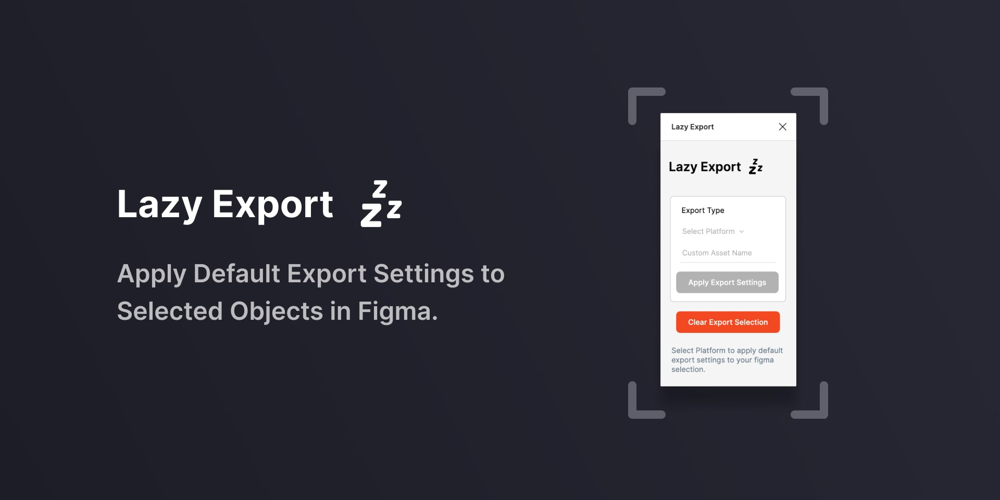

# Lazy Export

Lazy export is inspired by a feature that was apart of my workflow in Sketch. I became tired of manually applying export settings across assets and projects. So this was born March 21st, locked up in my apartment.

Lazy export is inspired by a feature that was apart of my workflow in sketch. I became tired of manually applying export settings across assets and projects. So this was born March 21st, locked up in my apartment.

### Have a feature request or bug? Please feel free to add an issue!

A Pull request would work perfectly, as well. You may have noticed in this repo I am talking to my self a lot as I use this space to keep learning. PR would get it done faster; I just may ask a lot of questions. 🤓

## What does it do?

**Lazy Export** allows the user to apply default export settings to selected objects in Figma.

## How does it work?

There are two ways to trigger your export settings to be applied. The first is a window giving you UI access to run the plugin commands. (Set Platform, Apply Settings, Clear Settings)
The second is via the plugin menu; this makes the actions searchable in Figma with the `⌘+/` command.

### Advanced Export Settings.

With Lazy export, you have two mobile options on how you can apply export settings.

- Default Export
- Advanced Export

With the default export, this follows the trends for exporting assets for mobile at the different screen densities. Advanced is still being worked on for a smooth workflow.

> The end goal for Advanced Export Options, would be for a developer to hit apply, and Figma exports a folder of assets the developer can just drop into Android Studio, or Xcode.

**Android Suffix**
`/drawable-mdpi/default-asset`

**IOS Suffix**
`/default-asset.imageset/default-asset@1x`

### Custom Asset Naming

Right now if you do not apply a custom name to each asset a default one will be used. _I have plans on the roadmap to adjust this._

**Android Suffix**
`drawable-mdpi`

**IOS Suffix**
`/default-asset@1x`

## Plugin Development Tips

### Tip 1:

to see the list of available JavaScript/Browser APIs on the main thread, run `console.log(this)` as the first line of your plugin.

## Built with Figsvelte

A boilerplate for creating Figma plugins using Svelte.

This starter project has everything you need to start developing a Figma plugin using Svelte. Your JS, CSS, SVG, and image assets can be bundled on build. The package will take care of compiling your typescript + app on save during development, and also minify on the build.

Additionally, this package comes preconfigured with [Figma Plugin DS Svelte](https://github.com/thomas-lowry/figma-plugin-ds-svelte) where you have access to an extensive range of components and icons that match the Figma UI, to get you up and running quickly. Note: installing this boilerplate will install the component library as a dependency.

Only what you import/use will be included in the final build for small bundle size.

### To get started

```bash
npx degit thomas-lowry/figsvelte figma-plugin
cd figma-plugin
npm install
```

_Note that you will need to have [Node.js](https://nodejs.org/) installed._

### Development

During development, watch your project for changes with the following command.

```bash
npm run dev
```

Start building your plugin UI in `'src/Plugin.svelte'`.

### Build

When ready to package up your final Figma Plugin:

```bash
npm run build
```

### Useful info

To include an external CSS file:

```javascript
import styles from "./styles.css";
```

To include an SVG:

```javascript
import SvgName from './image.svg';

//use in your markup
{@html SvgName}
```

_For more info on using the Icon component system with SVGs from [Figma Plugin DS Svelte](https://github.com/thomas-lowry/figma-plugin-ds-svelte), refer to the repo._
